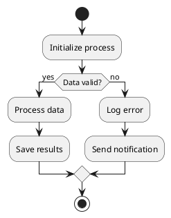

# Activity Diagram Example

[← Back to Home](/)

## Data Processing Flow

```plantuml
@startuml
start
:Initialize process;
if (Data valid?) then (yes)
  :Process data;
  :Save results;
else (no)
  :Log error;
  :Send notification;
endif
stop
@enduml
``` 