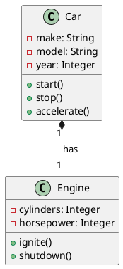

# Class Diagram Example

[← Back to Home](/)

## Car System Design

```plantuml
@startuml
class Car {
  - make: String
  - model: String
  - year: Integer
  + start()
  + stop()
  + accelerate()
}

class Engine {
  - cylinders: Integer
  - horsepower: Integer
  + ignite()
  + shutdown()
}

Car "1" *-- "1" Engine : has
@enduml
``` 