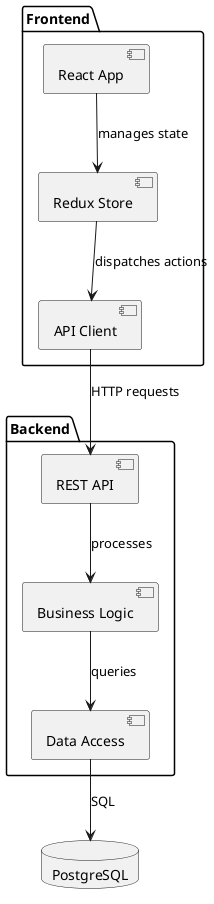

# Component Diagram Example

[← Back to Home](/)

## Web Application Architecture

```plantuml
@startuml
package "Frontend" {
  component [React App] as UI
  component [Redux Store] as Store
  component [API Client] as Client
}

package "Backend" {
  component [REST API] as API
  component [Business Logic] as Logic
  component [Data Access] as DAO
}

database "PostgreSQL" as DB

UI --> Store : manages state
Store --> Client : dispatches actions
Client --> API : HTTP requests
API --> Logic : processes
Logic --> DAO : queries
DAO --> DB : SQL

@enduml
```