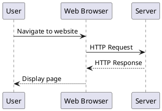
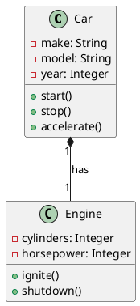
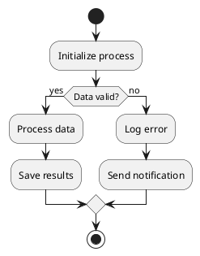

# Astro PlantUML Demo

This demo showcases the astro-plantuml integration for rendering PlantUML diagrams in Astro projects.

## Sequence Diagram Example

## Class Diagram Example

## Activity Diagram Example

## More Examples

- [Use Case Diagrams](/use-case)
- [State Diagrams](/state)
- [Component Diagrams](/component)