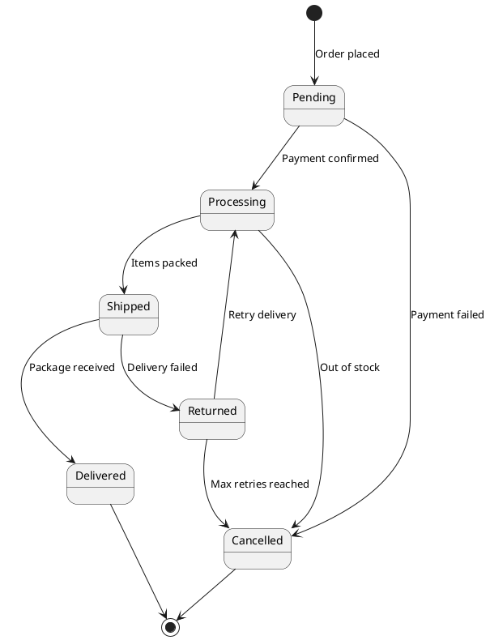

# State Diagram Example

[← Back to Home](/)

## Order Processing State Machine

```plantuml
@startuml
[*] --> Pending : Order placed

Pending --> Processing : Payment confirmed
Pending --> Cancelled : Payment failed

Processing --> Shipped : Items packed
Processing --> Cancelled : Out of stock

Shipped --> Delivered : Package received
Shipped --> Returned : Delivery failed

Delivered --> [*]
Cancelled --> [*]
Returned --> Processing : Retry delivery
Returned --> Cancelled : Max retries reached
@enduml
```