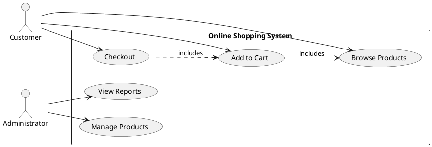

# Use Case Diagram Example

[← Back to Home](/)

## Online Shopping System

```plantuml
@startuml
left to right direction
actor Customer
actor Administrator

rectangle "Online Shopping System" {
  usecase "Browse Products" as UC1
  usecase "Add to Cart" as UC2
  usecase "Checkout" as UC3
  usecase "Manage Products" as UC4
  usecase "View Reports" as UC5
}

Customer --> UC1
Customer --> UC2
Customer --> UC3
Administrator --> UC4
Administrator --> UC5

UC2 ..> UC1 : includes
UC3 ..> UC2 : includes
@enduml
```